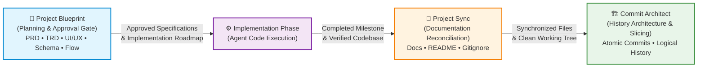

# agent-dev-skills

> **A curated collection of independent, cross-platform Agent Skills for disciplined software engineering with AI coding assistants.**

[](LICENSE)
[](https://agentskills.io)
[](#authorship)
[](#)

---

## Overview

**MYSKILLS** is an open personal collection of specialized **Agent Skills** designed to teach AI pair programmers and autonomous coding agents professional software engineering discipline.

Typical AI coding agents suffer from predictable behavioral pathologies:
* **Premature implementation:** Rushing into code generation on ambiguous instructions without architecture or user approval.
* **Documentation rot:** Leaving human-facing `README.md` files and repository ignore configurations (`.gitignore`) out of date after implementing features.
* **Chaotic version control:** Creating giant, unreviewable monolithic commits or noisy, single-line micro-commits with robotic conventional prefixes.

The skills in this collection solve these challenges by providing modular, vendor-neutral workflows adhering to the open [Agent Skills Specification](https://agentskills.io).

---

## The Skills Collection

| Skill | Primary Responsibility | Key Output | Status | Repository |
| :--- | :--- | :--- | :---: | :--- |
| **[Project Blueprint](./project-blueprint/)** | Pre-implementation planning, architectural clarification, and human approval gating | 5 core specs (`PRD`, `TRD`, `UI_UX`, `BACKEND_SCHEMA`, `APP_FLOW`) + `.blueprint/state.yaml` | **Production** | [`project-blueprint/`](./project-blueprint/README.md) |
| **[Project Sync](./project-sync/)** | Synchronizing `README.md` and `.gitignore` after meaningful implementation iterations | Reconciled documentation, quarantine of temporary artifacts, factual completion summary | **Production** | [`project-sync/`](./project-sync/README.md) |
| **[Commit Architect](./commit-architect/)** | Planning, slicing, dependency-ordering, diff-reviewing, and authoring natural Git commits | Cohesive atomic Git commits, clean history, natural programmer commit messages | **Production** | [`commit-architect/`](./commit-architect/README.md) |

---

## How the Skills Relate

The three skills are **completely independent and decoupled**. There are no runtime dependencies, hardcoded links, or required couplings between them. You can install and use any single skill on its own without installing the others.

When used together across a larger project lifecycle, they form a natural, closed-loop development pipeline:



* **Step 1 (Before Implementation):** **Project Blueprint** conducts targeted clarification, drafts synchronized architectural specifications with Mermaid diagrams, audits cross-document consistency, and enforces human sign-off before coding starts.
* **Step 2 (During/After Implementation):** The agent writes and tests the software.
* **Step 3 (Post-Implementation Reconciliation):** **Project Sync** inspects changed files, updates relevant `README.md` sections, updates `.gitignore`, quarantines temporary scratchpads into `.agent/scratch/`, and outputs a factual completion report.
* **Step 4 (Version Control Architecture):** **Commit Architect** reviews the working tree, partitions the completed work into dependency-ordered atomic slices, validates staged diffs, and records clean commits with natural developer messages.

---

## Detailed Skill Profiles

### 1. Project Blueprint 📐

* **Core Purpose:** Stops agents from diving blindly into implementation. Establishes a formal pre-implementation planning and human approval gate.
* **Key Mechanisms:**
  * **Targeted Clarification:** Interrogates vague prompts asking 1–2 prioritized questions at a time with opinionated defaults.
  * **5-Document Specification Suite:** Produces synchronized specifications: `PRD.md` (requirements), `TRD.md` (technical architecture), `UI_UX.md` (interface and ASCII layouts), `BACKEND_SCHEMA.md` (data models and endpoints), and `APP_FLOW.md` (user and state journeys).
  * **First-Class Visual Architecture:** Standardized Mermaid.js diagrams embedded directly in specifications (`flowchart`, `erDiagram`, `sequenceDiagram`).
  * **Cross-Document Consistency:** Audits requirement IDs (`REQ-xxx`) across documents and halts immediately upon detecting contradictions.
  * **Approval Gate & Version Invalidation:** Tracks lifecycle state in `.blueprint/state.yaml`. Strictly blocks code generation until explicit human approval is given. Changing requirements invalidates prior approval.
* **Verification Scripting:** Pure Python stdlib tools: `blueprint-state.py`, `check-consistency.py`, `validate-blueprint.py`.
* **Deep Dive:** Read the [Project Blueprint Guide](./project-blueprint/README.md).

### 2. Project Sync 🔄

* **Core Purpose:** Eliminates documentation drift by reconciling `README.md` and `.gitignore` after meaningful implementation iterations.
* **Key Mechanisms:**
  * **Meaningful-Iteration Trigger:** Evaluates changes only when public features, CLI commands, prerequisites, dependencies, or environment variables are altered. Remains silent on pure internal refactors.
  * **Surgical Documentation Edits:** Updates only the specific lines, tables, or sections affected by the change without rewriting unrelated human-authored prose.
  * **Safe Temporary Artifact Quarantine:** Prohibits silent file deletion. Quarantines genuine agent scratchpads into `.agent/scratch/`, adds the quarantine pattern to `.gitignore`, and reports them for human review.
  * **Preserving Manual Edits:** Detects uncommitted user edits in `README.md` or `.gitignore` and performs safe additive merges without clobbering.
  * **Transparent Completion Summary:** Concludes iterations with a four-state report (`Updated`, `No changes required`, `Not applicable`, `Unable to verify`) and lists quarantined items.
* **Verification Scripting:** Pure Python stdlib tools: `detect-readme-impact.py`, `audit-gitignore.py`, `generate-sync-summary.py`.
* **Deep Dive:** Read the [Project Sync Guide](./project-sync/README.md).

### 3. Commit Architect 🏗️

* **Core Purpose:** Teaches AI coding agents to plan, divide, stage, validate, and record clean, logical Git commit histories.
* **Key Mechanisms:**
  * **Logical Boundaries:** Splits commits by conceptual milestone rather than by file count or lines edited.
  * **Anti-Micro-Commit & Anti-Monolith:** Forbids trivial single-line noise commits while preventing 30-file catch-all megacomcommits.
  * **Dependency-Aware Ordering:** Sequences changes logically (foundations → data migrations → core logic → endpoints → UI → tests).
  * **Working-Tree Safety:** Audits dirty trees, protects pre-existing human edits, and bans destructive Git commands (`reset --hard`, `clean -fd`, `push -f`).
  * **Staged-Diff Review:** Enforces a 5-point diff checklist via `git diff --cached` before committing.
  * **Natural Developer Commit Messages:** Defaults to ordinary, professional programmer English (imperative mood, concise, no artificial prefixes). Follows Conventional Commits only if the repository explicitly mandates them.
* **Verification Scripting:** Pure Python stdlib tools: `inspect-working-tree.py`, `validate-staged-diff.py`, `verify-commit.py`.
* **Deep Dive:** Read the [Commit Architect Guide](./commit-architect/README.md).

---

## Independent Usage & Installation

Every skill can be installed independently at the **project level** (for a specific repository) or at the **global level** (for all projects on your workstation).

### Project-Level vs. Global Installation Comparison

| Installation Mode | Where Files Reside | Scope | Best For |
| :--- | :--- | :--- | :--- |
| **Project-Level** | Target repository (`.agents/skills/`, `.claude/skills/`, `.cursor/skills/`) | Single codebase | Team sharing via Git; repo-specific workflows |
| **Global / Machine** | User config (`~/.gemini/config/skills/`, `~/.claude/skills/`, `~/.cursor/skills/`) | All sessions | Personal developer toolchain across all workspaces |

---

### Installing an Individual Skill

#### Option A: Install ONLY Commit Architect
```bash
# In your target repository:
mkdir -p .agents/skills
cp -r /path/to/MYSKILLS/commit-architect/skill .agents/skills/commit-architect

# Or for Claude Code:
mkdir -p .claude/skills
cp -r /path/to/MYSKILLS/commit-architect/skill .claude/skills/commit-architect

# Or for Cursor:
mkdir -p .cursor/skills .cursor/rules
cp -r /path/to/MYSKILLS/commit-architect/skill .cursor/skills/commit-architect
cp /path/to/MYSKILLS/commit-architect/integrations/cursor/commit-architect.mdc .cursor/rules/
```
* **To Update:** Re-copy or pull updates from `commit-architect/skill`.
* **To Remove:** Delete the `.agents/skills/commit-architect/` directory.

#### Option B: Install ONLY Project Sync
```bash
# In your target repository:
mkdir -p .agents/skills
cp -r /path/to/MYSKILLS/project-sync/skill .agents/skills/project-sync

# Or for Claude Code:
mkdir -p .claude/skills
cp -r /path/to/MYSKILLS/project-sync/skill .claude/skills/project-sync

# Or for Cursor:
mkdir -p .cursor/skills .cursor/rules
cp -r /path/to/MYSKILLS/project-sync/skill .cursor/skills/project-sync
cp /path/to/MYSKILLS/project-sync/integrations/cursor/project-sync.mdc .cursor/rules/
```
* **To Update:** Re-copy or pull updates from `project-sync/skill`.
* **To Remove:** Delete the `.agents/skills/project-sync/` directory.

#### Option C: Install ONLY Project Blueprint
```bash
# In your target repository:
mkdir -p .agents/skills
cp -r /path/to/MYSKILLS/project-blueprint/skill .agents/skills/project-blueprint

# Or for Claude Code:
mkdir -p .claude/skills
cp -r /path/to/MYSKILLS/project-blueprint/skill .claude/skills/project-blueprint

# Or for Cursor:
mkdir -p .cursor/skills .cursor/rules
cp -r /path/to/MYSKILLS/project-blueprint/skill .cursor/skills/project-blueprint
cp /path/to/MYSKILLS/project-blueprint/integrations/cursor/project-blueprint.mdc .cursor/rules/
```
* **To Update:** Re-copy or pull updates from `project-blueprint/skill`.
* **To Remove:** Delete the `.agents/skills/project-blueprint/` directory.

---

## Platform Compatibility Matrix

All three skills adhere to the open [Agent Skills Specification](https://agentskills.io). Support across major platforms has been audited and verified against official upstream conventions:

| Platform | Skill Discovery Convention | Invocation Mode | Compatibility Level | Notes |
| :--- | :--- | :--- | :---: | :--- |
| **Google Antigravity** | `.agents/skills/<name>/SKILL.md`<br>`~/.gemini/config/skills/<name>/` | Model-Driven (Progressive Disclosure) / Direct Prompt | **Verified** | Full support for YAML metadata indexing, on-demand reference loading, and `ask_question` tool in Project Blueprint. |
| **Claude Code** | `.claude/skills/<name>/SKILL.md`<br>`~/.claude/skills/<name>/` | Model-Driven / Prompt | **Verified** | Native support for standard Agent Skills format. Optional hint in `CLAUDE.md`. |
| **Cursor** | `.cursor/skills/<name>/SKILL.md`<br>`.cursor/rules/*.mdc` | Model-Driven / Composer Chat | **Verified** | Full support for `SKILL.md` coupled with lightweight `.mdc` rules for ambient enforcement. |
| **OpenAI Codex** | `.codex/skills/<name>/SKILL.md`<br>`AGENTS.md` | Model-Driven / Direct `$command` | **Verified** | Standard `SKILL.md` loading supported, with persistent instructions in `AGENTS.md`. |
| **Generic Agent Systems** | Runtime dependent (`.skills/`) | System dependent | **Standards-Compatible** | Follows open `agentskills.io` standard with zero proprietary dependencies. |

### Compatibility Level Definitions:
* **Verified:** Formally tested and validated against current official platform directories, runtime behaviors, and discovery mechanisms.
* **Standards-Compatible:** Fully compliant with the vendor-neutral `agentskills.io` specification.
* **Experimental:** Upstream platform mechanism is in active alpha/beta or subject to breaking changes.
* **Unsupported:** Platform lacks local filesystem access, tool execution, or skill discovery mechanisms.

---

## Practical Examples

### Example 1: Project Blueprint in Action
**User Prompt:**
> *"Build an invitation system so team admins can invite new members by email."*

**Agent Flow:**
1. **Clarifies:** Asks 2 focused questions (role permissions and token expiration duration).
2. **Drafts Specs:** Generates `PRD.md`, `TRD.md`, `UI_UX.md`, `BACKEND_SCHEMA.md`, and `APP_FLOW.md` with Mermaid sequence and ER diagrams.
3. **Audits Consistency:** Runs `check-consistency.py` to confirm `REQ-001` is covered across all technical artifacts.
4. **Gates Implementation:** Initializes state in `.blueprint/state.yaml` as `READY_FOR_REVIEW`. Blocks code execution until user says *"Approved"*.

### Example 2: Project Sync in Action
**User Prompt:**
> *"Implement rate limiting on the public API using Redis."*

**Agent Flow:**
1. **Implements & Tests:** Implements Redis rate-limiting middleware and verifies unit tests pass.
2. **Detects Impact:** Runs `detect-readme-impact.py`, identifying new `REDIS_URL` and `RATE_LIMIT_RPM` environment variables.
3. **Surgically Reconciles:** Updates the Environment Variables table in `README.md`.
4. **Quarantines Scratch:** Moves ad-hoc load test script `stress_test.py` into `.agent/scratch/stress_test.py` and verifies `.agent/scratch/` is ignored in `.gitignore`.
5. **Summarizes:** Delivers transparent completion report itemizing README updates and quarantined files.

### Example 3: Commit Architect in Action
**User Prompt:**
> *"Connect the signup page to the authentication endpoint, handle network errors, and add tests."*

**Agent Flow:**
1. **Inspects Working Tree:** Runs `inspect-working-tree.py` to verify no unrelated edits are staged.
2. **Plans Sequence:** Designs two logical commits:
   - Commit 1: Core API client authentication method and unit tests.
   - Commit 2: Signup form submission UI, loading states, and error handling.
3. **Executes & Reviews Diff:** Implements Unit 1, reviews `git diff --cached`, and commits with:
   `Add user authentication client and token handling`
4. **Repeats for Unit 2:** Implements UI integration, tests, reviews diff, and commits with:
   `Handle signup form submission and network error display`

---

## Repository Structure

The actual structure of the `MYSKILLS` collection is organized as three standalone sibling repositories:

```text
MYSKILLS/
│
├── README.md                      # Central collection landing page & catalog (this document)
│
├── commit-architect/              # Independent Skill Repository: Commit Architecture
│   ├── README.md                  # Comprehensive skill documentation
│   ├── LICENSE                    # MIT License
│   ├── AUTHORS                    # Authorship attribution
│   ├── NOTICE                     # Legal disclaimers & trademark notices
│   ├── skill/                     # Canonical Open Agent Skill
│   │   ├── SKILL.md               # Main skill manifest with YAML frontmatter
│   │   ├── references/            # Deep reference manuals (progressive disclosure)
│   │   └── scripts/               # Pure Python stdlib verification tools
│   ├── integrations/              # Multi-platform adapters (Antigravity, Claude, Cursor, Codex)
│   ├── examples/                  # 12 real-world case study walkthroughs
│   └── docs/                      # Architecture, portability, and contribution guides
│
├── project-sync/                  # Independent Skill Repository: Project Synchronization
│   ├── README.md                  # Comprehensive skill documentation
│   ├── LICENSE                    # MIT License
│   ├── AUTHORS                    # Authorship attribution
│   ├── NOTICE                     # Legal disclaimers & trademark notices
│   ├── skill/                     # Canonical Open Agent Skill
│   │   ├── SKILL.md               # Main skill manifest with YAML frontmatter
│   │   ├── references/            # Deep reference manuals (progressive disclosure)
│   │   └── scripts/               # Pure Python stdlib verification tools
│   ├── integrations/              # Multi-platform adapters (Antigravity, Claude, Cursor, Codex)
│   ├── examples/                  # 17 real-world case study walkthroughs
│   └── docs/                      # Architecture, portability, and contribution guides
│
└── project-blueprint/             # Independent Skill Repository: Pre-Implementation Planning
    ├── README.md                  # Comprehensive skill documentation
    ├── LICENSE                    # MIT License
    ├── AUTHORS                    # Authorship attribution
    ├── NOTICE                     # Legal disclaimers & trademark notices
    ├── skill/                     # Canonical Open Agent Skill
    │   ├── SKILL.md               # Main skill manifest with YAML frontmatter
    │   ├── references/            # Deep reference manuals (progressive disclosure)
    │   └── scripts/               # Pure Python stdlib verification tools
    ├── integrations/              # Multi-platform adapters (Antigravity, Claude, Cursor, Codex)
    ├── examples/                  # 6 real-world reference blueprints & case studies
    └── docs/                      # Architecture, portability, and contribution guides
```

---

## Development & Contributing

Each skill is developed and maintained independently within its own directory:
1. **Canonical Standard:** Changes to core methodology belong in `skill/SKILL.md` and `skill/references/`.
2. **Zero Dependencies:** Helper scripts in `skill/scripts/` must run on Python 3.8+ using strictly the standard library. No third-party packages (`pip`) are permitted.
3. **Cross-Platform Encodings:** All scripts must explicitly configure UTF-8 output streams (`sys.stdout.reconfigure(encoding="utf-8", errors="replace")`) to run cleanly on Windows consoles as well as POSIX systems.
4. **Dogfooding:** Contributions should follow the Commit Architect standard for atomic commit slicing and Project Sync standards for documentation updates.

For specific contribution guidelines, see:
* [Commit Architect Contributing Guide](./commit-architect/docs/contributing.md)
* [Project Sync Contributing Guide](./project-sync/docs/contributing.md)
* [Project Blueprint Contributing Guide](./project-blueprint/docs/contributing.md)

---

## Licensing

All repositories and artifacts within MYSKILLS are distributed under the terms of the **MIT License**.

```text
MIT License

Copyright (c) 2026 SWAYAM KIRAN PRABHU

Permission is hereby granted, free of charge, to any person obtaining a copy
of this software and associated documentation files (the "Software"), to deal
in the Software without restriction, including without limitation the rights
to use, copy, modify, merge, publish, distribute, sublicense, and/or sell
copies of the Software, and to permit persons to whom the Software is
furnished to do so, subject to the following conditions:

The above copyright notice and this permission notice shall be included in all
copies or substantial portions of the Software.

THE SOFTWARE IS PROVIDED "AS IS", WITHOUT WARRANTY OF ANY KIND, EXPRESS OR
IMPLIED, INCLUDING BUT NOT LIMITED TO THE WARRANTIES OF MERCHANTABILITY,
FITNESS FOR A PARTICULAR PURPOSE AND NONINFRINGEMENT.
```

See individual repository license files:
* [Commit Architect License](./commit-architect/LICENSE)
* [Project Sync License](./project-sync/LICENSE)
* [Project Blueprint License](./project-blueprint/LICENSE)

---

## Authorship & Disclaimers

* **Creator and Copyright Owner:** **SWAYAM KIRAN PRABHU** (2026)
* **Project Status:** Independent Open-Source Software

### Third-Party Disclaimers
MYSKILLS is an independent open-source developer toolchain. It is not affiliated with, sponsored by, endorsed by, or officially associated with:
* Google LLC or Alphabet Inc. (*Google Antigravity, Gemini*)
* Anthropic PBC (*Claude, Claude Code*)
* Anysphere Inc. (*Cursor*)
* OpenAI OpCo LLC (*OpenAI, ChatGPT, Codex*)

All product names, trademarks, and registered trademarks are property of their respective owners.

---

## Reference Links & Documentation

### MYSKILLS Repositories
* [Commit Architect Repository Guide](./commit-architect/README.md)
* [Project Sync Repository Guide](./project-sync/README.md)
* [Project Blueprint Repository Guide](./project-blueprint/README.md)

### Standards & Official Upstream Documentation
* [Agent Skills Specification](https://agentskills.io)
* [Google Antigravity Customization Documentation](https://antigravity.google)
* [Anthropic Claude Code Documentation](https://docs.anthropic.com/en/docs/claude-code)
* [Cursor AI Rules Documentation](https://docs.cursor.com/context/rules-for-ai)
* [OpenAI Custom Instructions & AGENTS.md](https://platform.openai.com)
