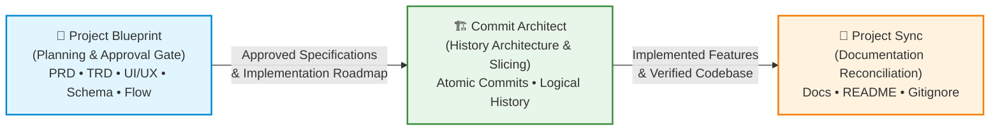

# Project Blueprint 📐

> **Pre-Implementation Planning, Architecture Specification, and Human Approval Gate for AI Coding Agents**

[](LICENSE)
[](https://agentskills.io)
[](AUTHORS)
[](#)

---

## 💡 Why Project Blueprint?

Autonomous AI coding agents frequently suffer from **premature implementation**:

* **Unverified Assumptions**: Diving straight into writing code based on ambiguous, one-line prompts.
* **Architectural Drift**: Picking mismatched database schemas, state stores, or libraries without holistically designing the system.
* **Visual Blind Spots**: Constructing complex user interactions or multi-step asynchronous lifecycles without defining user flows or wireframes.
* **Implementation Hallucination**: Creating contradictory APIs across frontend and backend services.
* **Lack of Human Alignment**: Generating thousands of lines of unaligned code before the user has a chance to evaluate the design.

**Project Blueprint** solves this failure mode once and for all. It teaches agents to pause, conduct structured interactive clarification, produce 5 synchronized specification documents with first-class visual diagrams, audit cross-document consistency, and enforce an **explicit, unbypassable human approval gate** before writing a single line of application code.

---

## 🚀 The Agent Developer Toolchain Triad

Project Blueprint is the foundational first stage of the **Agent Developer Toolchain Triad**, created by Swayam Kiran Prabhu:



* **[Project Blueprint](https://github.com/swayamprabhu/project-blueprint)**: Ensures the right software is built, with the right architecture, backed by explicit human approval.
* **[Commit Architect](../commit-architect/)**: Ensures the software is implemented cleanly, divided into reviewable, atomic Git commits.
* **[Project Sync](../project-sync/)**: Ensures documentation and repository configuration stay synchronized with the evolving implementation.

---

## 🔑 Core Features & Principles

### 1. Interactive Clarification Protocol
* **No Question Dumps**: Never overwhelms the user with dozens of questions. Asks 1–2 high-priority questions per turn.
* **Opinionated Defaults**: Presents recommended defaults with technical rationales (`(Recommended)`).
* **Prioritization Tiers**: Systematically prioritizes:
  1. *Core Product Scope & Architecture*
  2. *Tech Stack & Integrations*
  3. *Data Modeling & Persistence*
  4. *UX Patterns & Ergonomics*
* **Stopping Criteria**: Halts questioning as soon as the core path is unambiguous; records non-critical items as explicit assumptions (`ASSUM-xxx`).

### 2. The 5 Core Specification Artifacts
Every blueprint produces a cohesive suite of 5 synchronized documents stored in `.blueprint/` (or repository root):

1. **`PRD.md` (Product Requirements Document)**: Problem statement, target personas, functional requirements tagged with unique identifiers (`REQ-xxx`), non-functional requirements, assumptions (`ASSUM-xxx`), and open questions (`OPEN-xxx`).
2. **`TRD.md` (Technical Requirements Document)**: Architecture decisions, technology stack, directory layout, security posture, deployment topology, and technical risk mitigations.
3. **`UI_UX.md` (UI/UX Specification)**: Information architecture, design tokens, component hierarchy, responsive breakpoints, interaction states, and textual ASCII wireframes.
4. **`BACKEND_SCHEMA.md` (Backend & Schema Design)**: Data models, entity-relationship diagrams, database schemas, indexes, migrations, REST/GraphQL API specifications, error formats, and authentication contracts.
5. **`APP_FLOW.md` (Application & State Flow)**: Core user journeys, state transition machines, asynchronous background event lifecycles, cross-cutting concerns, and error recovery sequences.

### 3. First-Class Visual Architecture (Mermaid.js)
Every specification document includes standardized, valid Mermaid diagrams to make system architecture visually intuitive:
* `TRD.md`: `flowchart TD` / `flowchart LR` component block diagrams.
* `BACKEND_SCHEMA.md`: `erDiagram` with typed attributes and cardinality relationships.
* `APP_FLOW.md`: `sequenceDiagram` for distributed interactions and `stateDiagram-v2` for lifecycle states.

### 4. Cross-Document Consistency Engine
Project Blueprint mandates strict cross-document alignment. If `PRD.md` defines `REQ-003: Google OAuth`, then:
* `TRD.md` must declare Google OAuth client libraries and environment variables.
* `BACKEND_SCHEMA.md` must include an `auth_providers` or `oauth_accounts` table.
* `UI_UX.md` must include the Google sign-in button and login modal.
* `APP_FLOW.md` must chart the OAuth redirect sequence.

*Any contradiction triggers an immediate halt and revision.*

### 5. Explicit, Unbypassable Approval Gate
The agent is **strictly prohibited from writing implementation code** until explicit human approval is received.
* Managed via `.blueprint/state.yaml`.
* Tracks 7 distinct states: `not_started` ➔ `clarifying` ➔ `drafting` ➔ `review_requested` ➔ `approved` ➔ `implementing` ➔ `completed`.
* Explicit verbal consent (e.g., "Approved", "Looks good, proceed") or CLI confirmation is required.
* Any requirement change during review immediately invalidates approval and returns the state to `drafting`.

---

## 📂 Repository Structure

```
project-blueprint/
├── skill/                             # Canonical Agent Skill Standard
│   ├── SKILL.md                       # Main Open Agent Skills manifest
│   ├── references/                    # Deep reference manuals (progressive disclosure)
│   │   ├── questioning.md             # Questioning protocols & stopping criteria
│   │   ├── artifact-model.md          # 5-document detailed schemas and templates
│   │   ├── approval-gate.md           # 7-state workflow machine & approval rules
│   │   ├── document-guidelines.md     # REQ tagging & anti-fluff rules
│   │   ├── mermaid-guidelines.md      # Mermaid diagram patterns & best practices
│   │   ├── consistency-checks.md      # 5-point cross-document audit protocol
│   │   ├── evolution.md               # Drift detection & incremental updates
│   │   └── examples.md                # Case study index
│   └── scripts/                       # Standalone Python verification tools
│       ├── blueprint-state.py         # State machine & YAML manager
│       ├── check-consistency.py       # Cross-document traceability auditor
│       └── validate-blueprint.py      # Linter for document and Mermaid syntax
├── integrations/                      # Thin platform adapters
│   ├── antigravity/                   # Google Antigravity plugin manifest
│   ├── claude-code/                   # Claude Code integration instructions
│   ├── cursor/                        # Cursor .cursorrules / .mdc rules
│   ├── codex/                         # OpenAI Codex AGENTS.md instructions
│   └── generic/                       # Universal Open Agent Skills loader
├── examples/                          # Production-grade reference blueprints
│   ├── a-new-saas-app/                # Complete 5-document blueprint + state + plan
│   ├── b-existing-repository/         # Brownfield adaptation example
│   ├── c-requirement-change/          # Incremental evolution & invalidation
│   ├── d-contradictory-artifacts/     # Halting on cross-document contradiction
│   ├── e-implementation-drift/        # Pausing on real-world environment limits
│   └── f-small-task/                  # Negative boundary (skipping trivial tasks)
├── docs/                              # Maintainer and architecture docs
│   ├── architecture.md                # Progressive disclosure & decoupled core
│   ├── portability.md                 # Cross-platform compatibility matrix
│   └── contributing.md                # Contribution standards & author attribution
├── LICENSE                            # MIT License (© 2026 Swayam Kiran Prabhu)
├── AUTHORS                            # Creator and maintainer attribution
├── NOTICE                             # Disclaimers and legal notices
└── README.md                          # Main project guide
```

---

## 🛠️ Standalone Verification CLI

Project Blueprint ships with 3 zero-dependency Python 3 tools located in `skill/scripts/`:

### 1. Validate Blueprint Structure & Diagrams
Verifies that all 5 documents exist, contain non-trivial content, and have syntactically valid Mermaid diagrams:
```bash
python skill/scripts/validate-blueprint.py --dir .blueprint
```

### 2. Audit Cross-Document Consistency
Checks requirement (`REQ-xxx`) coverage across all technical documents, detects unresolved open questions (`OPEN-xxx`), and flags contradictory markers:
```bash
python skill/scripts/check-consistency.py --dir .blueprint
```

### 3. Manage Blueprint State & Approval Gate
Inspects and advances the blueprint lifecycle state:
```bash
# Check current state
python skill/scripts/blueprint-state.py status --dir .blueprint

# Initialize state for a new project
python skill/scripts/blueprint-state.py init --title "TeamSync SaaS" --dir .blueprint

# Request user review
python skill/scripts/blueprint-state.py request-review --dir .blueprint

# Record explicit user approval
python skill/scripts/blueprint-state.py approve --notes "Approved by lead architect" --dir .blueprint

# Transition to implementation
python skill/scripts/blueprint-state.py start-implementation --dir .blueprint
```

---

## 🌐 Platform Installation & Usage

Project Blueprint works across all major agentic programming environments:

### Google Antigravity
Copy or symlink `integrations/antigravity` into your Antigravity plugins directory or load the skill directly from `skill/SKILL.md`.
* Native support for `ask_question` tool for interactive clarification.
* Automatic artifact rendering in Antigravity Brain workspaces.

### Claude Code
Add Project Blueprint to your `CLAUDE.md` or invoke it as an agent skill:
```markdown
# Agent Skills
- Project Blueprint: d:/MyFiles/MYSKILLS/project-blueprint/skill/SKILL.md
```

### Cursor (Cursor Composer / Rules)
Copy `integrations/cursor/project-blueprint.mdc` into `.cursor/rules/` in your workspace.

### OpenAI Codex & AGENTS.md
Include `integrations/codex/agents-instructions.md` in your repository's `AGENTS.md` file.

---

## ⚖️ License & Attribution

* **Author & Maintainer**: [Swayam Kiran Prabhu](AUTHORS)
* **Copyright**: © 2026 Swayam Kiran Prabhu
* **License**: [MIT License](LICENSE)

*Project Blueprint is an independent, open-source project adhering to the open Agent Skills standard. All third-party platform names, trademarks, and logos are properties of their respective owners.*
