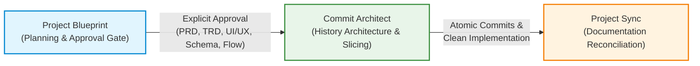

# Project Blueprint: Portability & Cross-Platform Architecture

Project Blueprint is designed from the ground up to be **strictly portable and vendor-neutral**. It operates seamlessly across Google Antigravity, Anthropic Claude Code, Cursor, OpenAI Codex, and generic Open Agent Skills platforms without requiring modifications to the core skill logic.

---

## 1. Portability Principles

1. **Vendor Independence**: No proprietary runtime libraries, vendor-locked prompt decorators, or proprietary schema locks.
2. **Canonical Core**: A single source of truth (`skill/SKILL.md` and `skill/references/`) adhering to the open [Agent Skills Specification](https://agentskills.io).
3. **Thin Integration Adapters**: Platform-specific discovery mechanisms and wrappers (`integrations/`) map platform conventions to the canonical core.
4. **Pure Python Tooling**: Standalone scripts utilize strictly the Python 3 standard library (`sys`, `os`, `re`, `argparse`, `json`, `datetime`) with zero third-party dependencies (`pyyaml`, `click`, etc.).
5. **Universal UTF-8 Encoding**: Explicit stdout and file encoding safeguards ensure identical behavior on POSIX (`UTF-8`) and Windows (`cp1252` / UTF-16).

---

## 2. Platform Compatibility Matrix

| Platform / Runtime | Integration Type | Questioning Mechanism | Blueprint Validation | State Tracking |
| :--- | :--- | :--- | :--- | :--- |
| **Google Antigravity** | Native Plugin (`plugin.json` + `SKILL.md`) | `ask_question` tool / Chat turn | `run_command` + python scripts | `.blueprint/state.yaml` |
| **Claude Code** | CLAUDE.md / Skill link | Direct interactive CLI prompt | Bash execution of python scripts | `.blueprint/state.yaml` |
| **Cursor** | `.cursor/rules/project-blueprint.mdc` | Composer / Chat dialog | Terminal execution | `.blueprint/state.yaml` |
| **OpenAI Codex** | `AGENTS.md` / Custom Instructions | Conversation turn prompt | CLI execution | `.blueprint/state.yaml` |
| **Generic / agentskills.io**| Canonical `SKILL.md` loader | Standard agent chat input | Standard agent shell execution | `.blueprint/state.yaml` |

---

## 3. Platform-Specific Questioning Adaptation

Interactive clarification is the foundation of Project Blueprint. Because different platforms expose varying mechanisms for gathering human input, Project Blueprint defines an adaptive interaction protocol:

### A. Google Antigravity
* If the agent runtime provides native structured interrogation tools (such as `ask_question`), Project Blueprint utilizes them for structured, multi-choice, or single-select clarification.
* When native tools are absent or inapplicable, the agent outputs 1–2 numbered, concise questions directly in the conversation turn and stops.

### B. Claude Code & Cursor Composer
* Questions are printed directly in the terminal or chat response with concrete options and recommended defaults:
  ```markdown
  1. Which session store should we use?
     a) Redis 7 (Recommended for distributed scale)
     b) In-memory NodeCache (Recommended for single-instance prototype)
  ```
* The agent suspends execution and awaits user response before drafting documents.

### C. OpenAI Codex & Generic Runtimes
* In batch or headless agent workflows, the agent outputs the clarifying questions, writes preliminary assumptions to `.blueprint/PRD.md` under `## 5. Explicit Assumptions (ASSUM-xxx)`, and requests user verification before finalizing approval.

---

## 4. Standalone Tooling Portability

The Project Blueprint helper scripts (`blueprint-state.py`, `check-consistency.py`, and `validate-blueprint.py`) are designed for maximum portability:

* **Zero External Dependencies**: Standard Python 3.8+ compatibility. No need to run `pip install pyyaml` or configure virtual environments.
* **Built-in YAML Engine**: Includes a deterministic, self-contained YAML parser and serializer for the `.blueprint/state.yaml` schema.
* **Cross-Platform Pathing**: Uses `pathlib` and `os.path` normalization to handle Windows backslashes (`\`) and POSIX forward slashes (`/`) transparently.
* **Standard Exit Codes**:
  - `0`: Success / Audit Passed
  - `1`: Validation Failure / Lint Errors
  - `2`: Blocking Contradiction / Consistency Halting

---

## 5. Reusable Ecosystem Interoperability

Project Blueprint is designed as the foundational first stage of the **Agent Developer Toolchain Triad**:



1. **Project Blueprint** generates unambiguous, approved technical specifications and an implementation roadmap.
2. **Commit Architect** consumes the roadmap and partitions the implementation into logical, atomic Git commits.
3. **Project Sync** reconciles project documentation, READMEs, changelogs, and gitignore configs after each completed iteration.

Each skill functions independently as a standalone tool, but together they form a comprehensive, closed-loop development lifecycle for autonomous AI coding agents.
