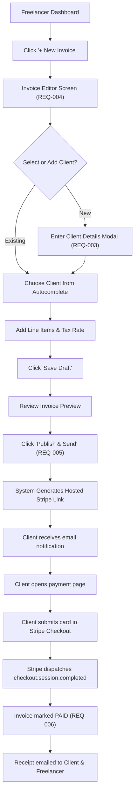

# Application & User Flow: Freelance Invoice Manager

## 1. Primary User Journey: Create, Send, and Collect Invoice
This flow traces how an authenticated freelancer creates an invoice draft, publishes a Stripe Checkout session, and receives notification of payment.

## 2. Navigation & Workflow Flowchart

## 3. Error Recovery & Edge Case Flows
* **Stripe Payment Cancellation:** If client aborts Checkout, Stripe redirects to `cancel_url`; invoice remains `UNPAID` and available for retry.
* **Network Timeout on Save:** Editor auto-saves drafts to browser `localStorage` to prevent data loss.
