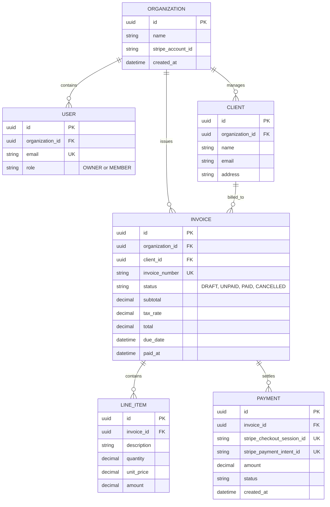

# Backend & Database Schema: Freelance Invoice Manager

## 1. Relational Schema Overview
The database uses PostgreSQL with foreign key cascades and UUID primary keys.

## 2. Entity-Relationship Diagram

## 3. Database Constraints & Indexes
* `invoices (organization_id, invoice_number)` has a composite UNIQUE constraint.
* `invoices (status)` is indexed for dashboard status filtering.
* `payments (stripe_checkout_session_id)` has a unique index for webhook deduplication.
