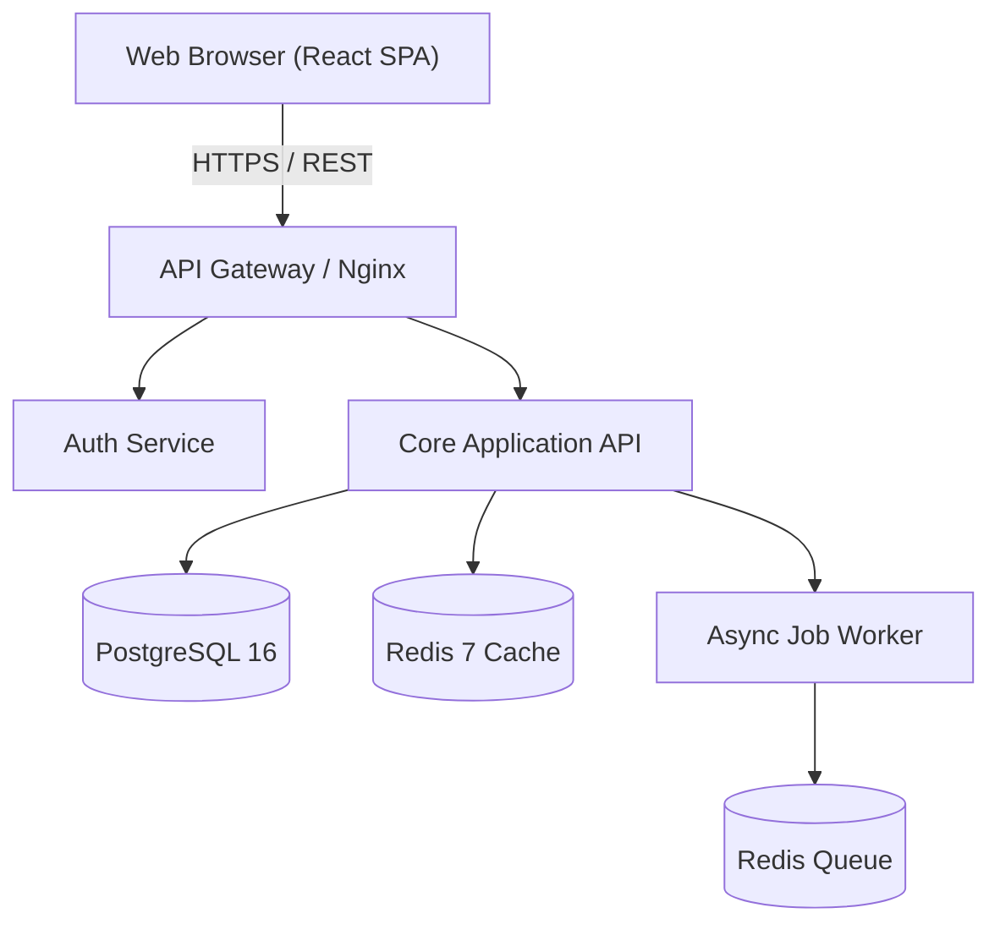
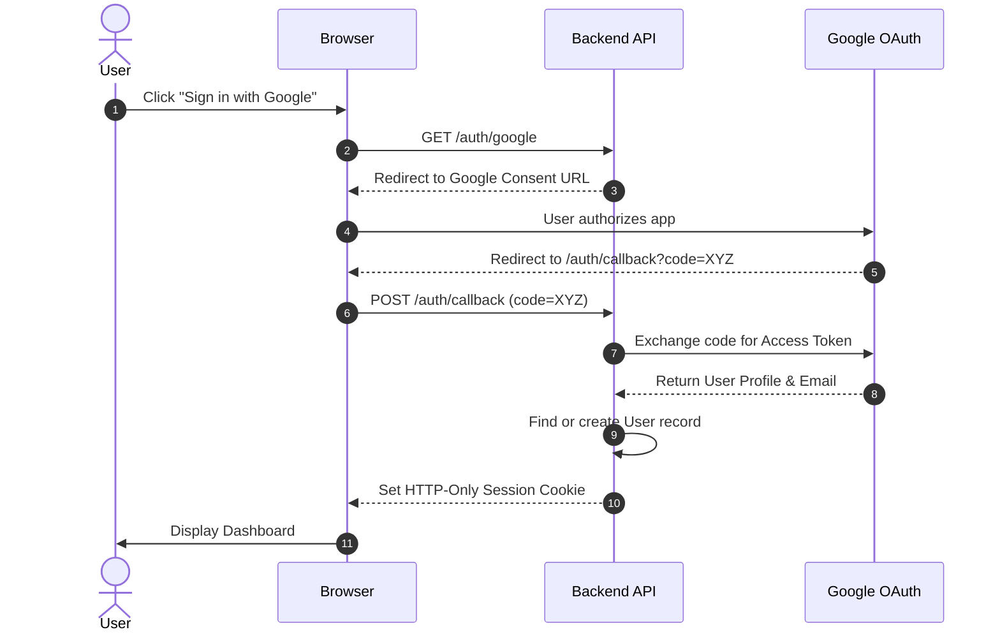
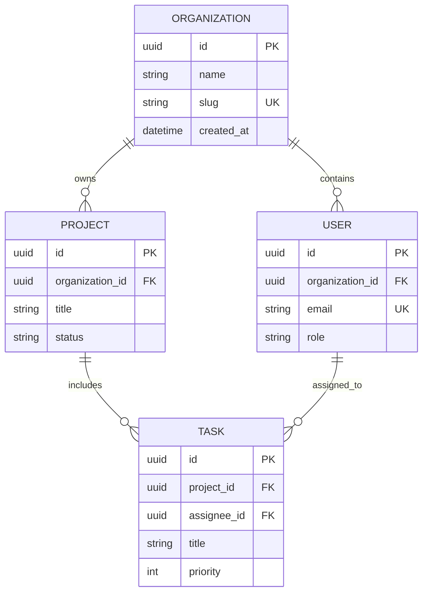
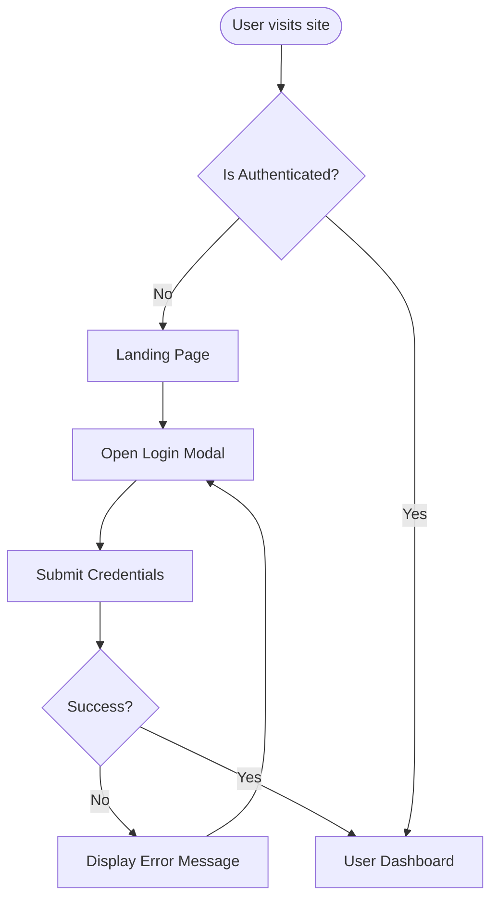

# Mermaid Diagram Standards & Best Practices

This guide establishes conventions and syntax rules for embedding Mermaid diagrams within Project Blueprint artifacts.

---

## 1. Why Diagrams Are First-Class Citizens

Text-based diagrams embedded in Markdown:
1. Are stored directly in Git history (trackable diffs across versions).
2. Render natively in GitHub, GitLab, IDEs, and modern Markdown viewers.
3. Allow reviewers to spot architectural bottlenecks or circular dependencies faster than reading 10 pages of prose.

---

## 2. Diagram Types by Artifact

### 1. `TRD.md`: System Architecture Block Diagrams
Use `flowchart TD` or `flowchart LR` to represent physical and logical component boundaries:

### 2. `TRD.md`: Authentication & Payment Handshakes
Use `sequenceDiagram` for complex multi-party interactions:

### 3. `BACKEND_SCHEMA.md`: Entity-Relationship Diagrams
Use `erDiagram` to map relational schemas and foreign keys:

### 4. `APP_FLOW.md`: Navigation & Decision Flowcharts
Use `flowchart TD` with decision diamonds (`{?}`) to map user journeys:

---

## 3. Syntax Rules to Prevent Rendering Errors

1. **Quote Node Labels with Special Characters:**
   Always wrap node labels containing parentheses, colons, or brackets in double quotes:
   * ❌ `id[Dashboard (Main View)]`
   * ✅ `id["Dashboard (Main View)"]`
2. **Avoid HTML Tags in Labels:**
   Use plain text inside labels to ensure cross-renderer compatibility.
3. **Partition Large Systems:**
   If a system has more than 15 entities, create one high-level domain diagram plus focused sub-diagrams (e.g. Auth Domain, Invoicing Domain) rather than one unreadable mega-diagram.
